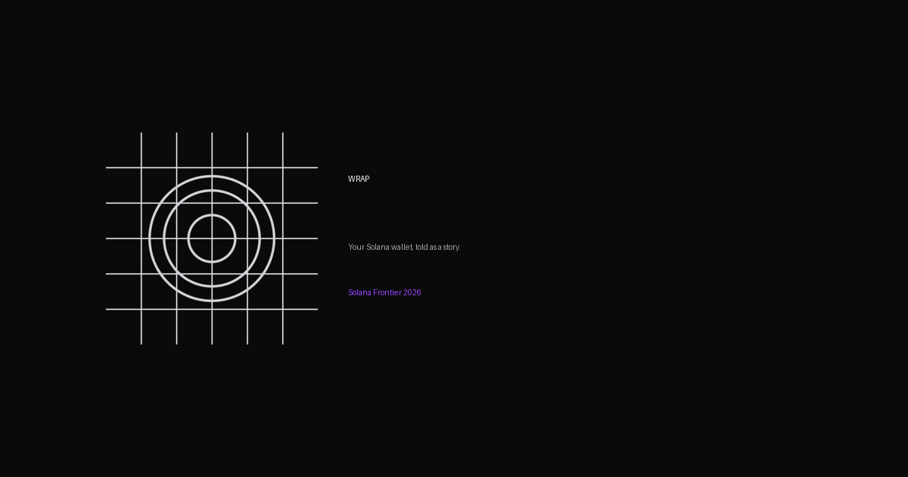

# WRAP

> Your Solana wallet, told as a story.
> Mobile-first identity layer for Solana — every wallet has a story,
> we tell it. AI personality cards, mintable as cNFTs, with head-to-head
> wallet Battles. Built for Solana Frontier 2026.

[](https://getwrap.vercel.app)
[](https://github.com/vowctminibro/wrap/releases/latest)
[](https://youtube.com/shorts/CHoOqUYqAzs)
[](https://x.com/getwrap)



## Quick Start

- 📱 **Try it:** [Download APK](https://github.com/vowctminibro/wrap/releases/latest) → install → tap "Sample wallet"
- 🎬 **Watch demo:** [60-second walkthrough](https://youtube.com/shorts/CHoOqUYqAzs)
- 🌐 **Landing:** [getwrap.vercel.app](https://getwrap.vercel.app)
- 📄 **Submission:** [SUBMISSION.md](./SUBMISSION.md)

## What WRAP does

Connect a Solana wallet → we read its on-chain history via Helius → an
LLM turns the data into 15-word punchy personality cards (Diamond Hand,
OG Status, 2026 Recap) you can share to X or mint as a cNFT via
Bubblegum. Then take that wallet identity into head-to-head Battles —
score 4 categories against any other Solana wallet, watch a round-by-
round reveal, and the winner gets a shareable Pinata-pinned leaderboard
image that unfurls cleanly on Twitter.

## Tech stack

- **Expo SDK 54** (TypeScript strict, React Native 0.81, React 19)
- **Solana Mobile Wallet Adapter** for Seeker / Phantom / Solflare connect
- **Helius** for Enhanced Transactions + DAS (`getAssetsByOwner`,
  `showFungible`) — single round trip yields fungible holdings *and*
  NFTs/cNFTs with USD price info; 12 s timeout + retry layer for
  Toly-scale wallets
- **Gemini 2.5 Flash** (primary) → **Groq Llama 3.3 70B** (fallback) →
  hand-crafted mock pool. 10 s timeout per provider, 15-word voice
  enforced via system prompt + post-processor
- **Metaplex `mpl-bubblegum` 5.x + `umi`** for cNFT mint on devnet
  (Merkle tree pre-provisioned, EAS-injected delegate signer)
- **Pinata IPFS** for shareable leaderboard image hosting
- **`react-native-view-shot` + `expo-sharing`** for capturing cards
  to PNG and opening the system share sheet
- **Next.js 16 + Tailwind v4 + Upstash Redis** for the landing page
  and `/api/notify` waitlist (`getwrap.vercel.app`)

## Architecture

```
~/Projects/wrap/
├── README.md                  (you are here)
├── SUBMISSION.md              Frontier 2026 submission narrative
├── PROGRESS.md                day-by-day sprint log
├── docs/hero.png              README hero
├── research/                  audit notes, demo battle pubkey research
├── scripts/                   devnet helpers + smoke tests
├── landing/                   Next.js 16 landing → getwrap.vercel.app
│   ├── app/                   page.tsx, layout.tsx, /api/notify route
│   ├── components/            HeroSection, NotifyModal
│   └── public/                /brand assets, /screenshots, /founder.png
└── mobile/                    Expo app
    ├── app.json + eas.json    EAS preview (apk) + production (aab)
    └── src/
        ├── screens/           Onboarding, CardReveal, MintConfirm,
        │                       BattleInput, BattleResult, Leaderboard,
        │                       WalletDetail
        ├── components/        Card, ShareLeaderboardCard, AffiliateButton
        ├── services/          helius, llm, cnft-mint, battle-engine,
        │                       battleHistory, pinata
        ├── lib/               wallet (MWA), wallet-analyzer,
        │                       insight-engine, errors, llm-cache,
        │                       share-card
        ├── data/              known-wallets, demo-battle-pairs,
        │                       seededBattles
        ├── prompts/           diamond-hand, og-status, year-recap
        └── theme/tokens.ts    single source of design truth
```

## Dev setup

```bash
cd mobile
pnpm install
cp .env.local.example .env.local      # if a fresh clone — fill keys below
```

`mobile/.env.local` (gitignored, all `EXPO_PUBLIC_*`):

```
EXPO_PUBLIC_HELIUS_KEY=<helius mainnet key>
EXPO_PUBLIC_GEMINI_KEY=<google ai studio key>
EXPO_PUBLIC_GROQ_KEY=<groq key>
EXPO_PUBLIC_MERKLE_TREE_PUBKEY=<from setup-merkle-tree.ts>
EXPO_PUBLIC_WRAP_DELEGATE_SECRET=<base64 keypair, devnet>
EXPO_PUBLIC_PINATA_JWT=<pinata jwt>
EXPO_PUBLIC_PINATA_GATEWAY=<https://...mypinata.cloud>
```

EAS cloud builds source these from the EAS `production` environment
(see `eas.json`'s preview profile — `"environment": "production"`).
Local-only dev still reads `.env.local`.

Verify the build:

```bash
cd mobile
pnpm tsc --noEmit                     # 0 errors expected
npx expo-doctor                       # 17/17 checks expected
```

## Smoke tests (no device required)

From the repo root:

```bash
npx tsx scripts/test-analyzer.ts                              # default test wallet
npx tsx scripts/test-analyzer.ts <PUBKEY>                     # any pubkey
npx tsx scripts/test-insights.ts                              # all 3 cards via Gemini→Groq→mock
```

`test-insights.ts` prints provider, raw output, sanitized output, and
final `CardData[]` for prose-quality review.

## On-device demo flow

1. **Onboarding** — `Connect Wallet` (MWA) or `Try Sample Wallet`. If no
   wallet app is installed, an in-app modal points users at the sample flow.
2. **CardReveal** — gradient pulse loader → 3 swipeable AI cards
   (Diamond, OG, Recap) → bottom CTAs: `Share to 𝕏`, `Mint as NFT`, plus
   per-card affiliate links to Magic Eden / Jupiter.
3. **MintConfirm** — confetti + glowing mini card, `View on Solscan` and
   `Share again`. Live cNFT mint via Bubblegum on devnet.
4. **Battle** — pick a demo pair (Toly vs Ansem) or paste any custom
   wallet → 4-round live engine → round-by-round reveal animation
   (~10 s) with LLM commentary → final result.
5. **Leaderboard** — 3 seeded battles (Toly, Raj, Mert, Ansem) plus any
   live battles you've run. Tap any wallet for their full battle
   history; tap any battle row to replay it. Tap the share button
   (top right) to upload a 1200×675 leaderboard PNG to Pinata IPFS
   and open the share sheet with the public URL.

## Status

Day 15 of 18. APK live at
[v0.1.0-preview](https://github.com/vowctminibro/wrap/releases/latest)
(devnet). Landing live at [getwrap.vercel.app](https://getwrap.vercel.app)
with email-capture waitlist. Submission narrative in
[SUBMISSION.md](./SUBMISSION.md). See `PROGRESS.md` for the day-by-day
build log.

## License

TBD — pending hackathon-submission requirements.
